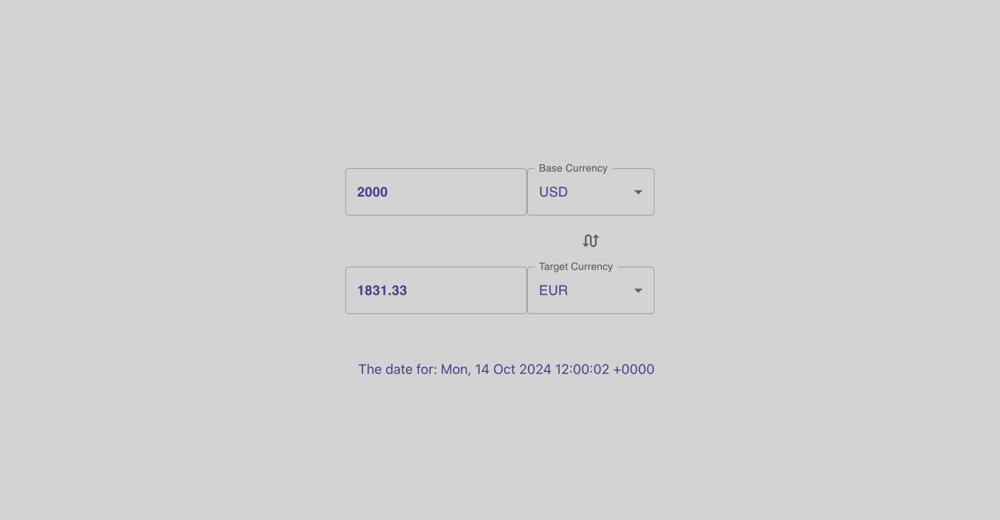

# Конвертер валют

_Веб-приложение, позволяющее пользователям конвертировать суммы между различными валютами с использованием актуальных курсов обмена_

## Демо

[Конвертер валют](ссылка_на_ваш_проект)

## Описание

В этом проекте реализован конвертер валют с использованием [ExchangeRate API](https://www.exchangerate-api.com/) для получения актуальных курсов валют и [Material-UI](https://mui.com/) для создания интерфейса. Пользователи могут выбрать исходную и целевую валюты, ввести сумму для конвертации и мгновенно получить результат.

### Основные функции:

- **Выбор валюты**: интерфейс для выбора исходной и целевой валют.
- **Актуальные курсы обмена**: получение курсов валют в реальном времени через ExchangeRate API.
- **Конвертация суммы**: мгновенный расчет эквивалентной суммы в целевой валюте.
- **Удобный интерфейс**: использование Material-UI для создания простого в использовании интерфейса.
